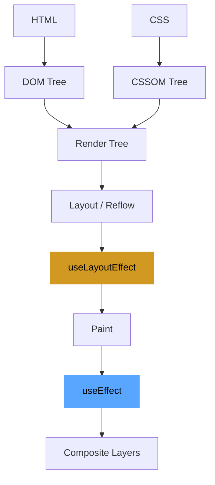

# Browser Rendering Pipeline
Understanding how a browser renders is critical for optimizing frontend performance:

1. **DOM/CSSOM Construction:** Parsing HTML and CSS.
2. **Render Tree:** Combining DOM and CSSOM.
3. **Layout (Reflow):** Calculating the geometry (position/size) of each node.
4. **Paint:** Filling in pixels.
5. **Compositing:** Layering the painted parts.

**Crucial Point:** `useLayoutEffect` runs synchronously after Layout but *before* Paint, whereas `useEffect` runs after Paint.
