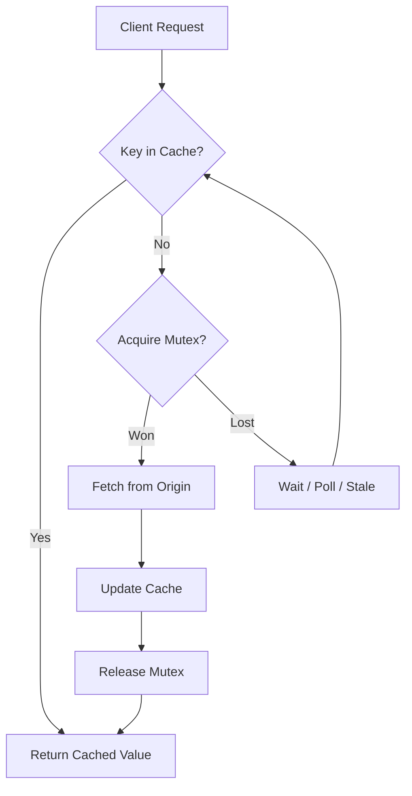

# Cache Stampede Prevention

A cache stampede occurs when concurrent requests regenerate an absent or expired hot key at the same time. Request coalescing, locking, stale serving, and expiry jitter reduce origin load.

