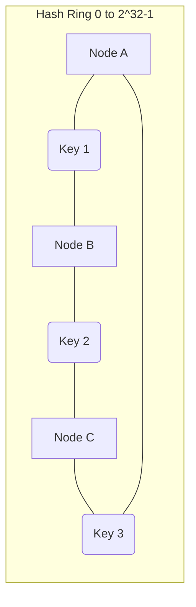

# Consistent Hashing

Consistent hashing maps keys to nodes so adding or removing a node remaps only part of the keyspace. Virtual nodes improve distribution when node capacity or key distribution is uneven.

