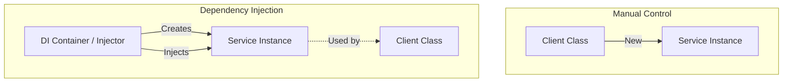

# Dependency Injection
Dependency Injection is a design pattern in which an object or function receives other objects or functions that it depends on. It is a form of **Inversion of Control (IoC)**, where the creation and binding of dependencies are handled by an external entity (the DI Container).

