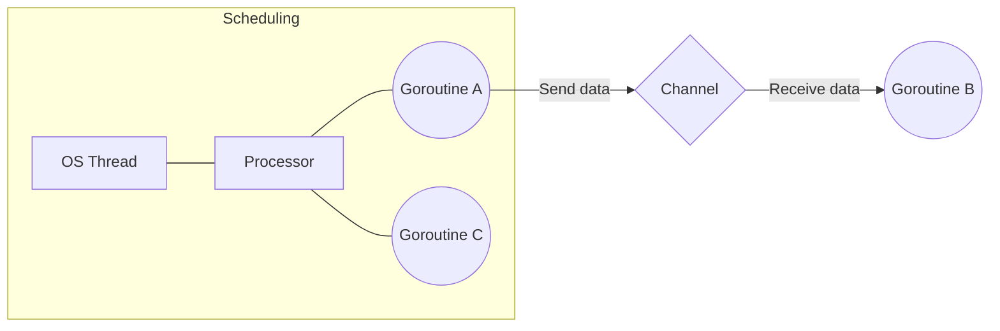

# Go Goroutines and Channels

Goroutines are lightweight concurrent functions managed by the Go runtime. Channels let goroutines synchronize and exchange typed values, while cancellation and ownership prevent leaks and deadlocks.

