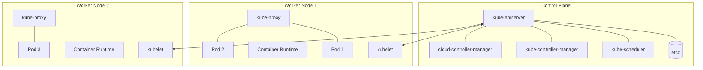

# Kubernetes Architecture

A Kubernetes cluster consists of two types of resources: the **Control Plane** and **Nodes**.

## 1. Control Plane
The "brain" of the cluster. It makes global decisions (like scheduling) and detects/responds to cluster events.
- **kube-apiserver:** The front end for the Kubernetes control plane. It exposes the API.
- **etcd:** Consistent and highly-available key-value store used as Kubernetes' backing store for all cluster data.
- **kube-scheduler:** Watches for newly created Pods with no assigned node, and selects a node for them to run on.
- **kube-controller-manager:** Runs controller processes (like Node Controller, Job Controller).
- **cloud-controller-manager:** Links your cluster into your cloud provider's API.

## 2. Nodes
The worker machines that run applications.
- **kubelet:** An agent that runs on each node in the cluster. It ensures that containers are running in a Pod.
- **kube-proxy:** A network proxy that runs on each node, maintaining network rules and performing connection forwarding.
- **Container Runtime:** The software responsible for running containers (e.g., Docker, containerd, CRI-O).

## 3. Objects
- **Pod:** The smallest deployable units of computing that you can create and manage in Kubernetes.
- **Service:** An abstract way to expose an application running on a set of Pods as a network service.
- **Volume:** A directory containing data, accessible to the containers in a Pod.
- **Namespace:** Virtual clusters backed by the same physical cluster.
