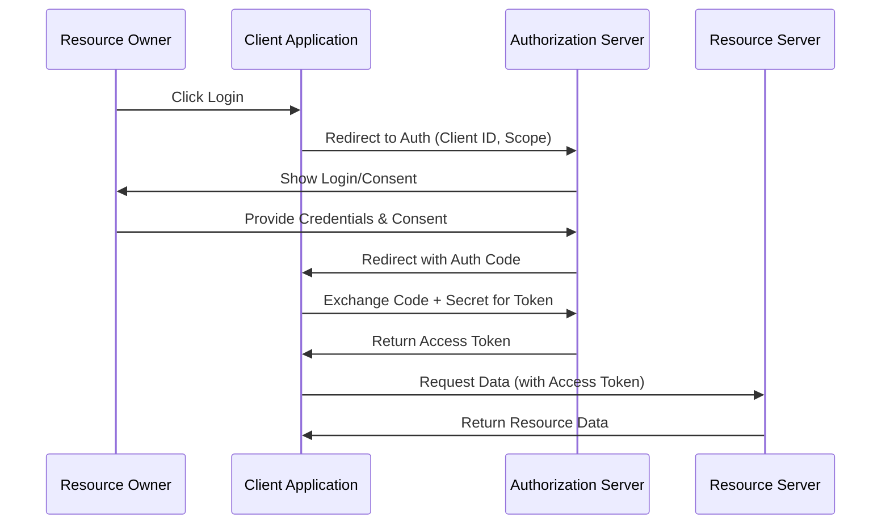

# OAuth 2.0 Authorization

OAuth 2.0 is an authorization framework in which a resource owner grants a client limited access to a resource server. It does not itself define user authentication; OpenID Connect adds that identity layer.

