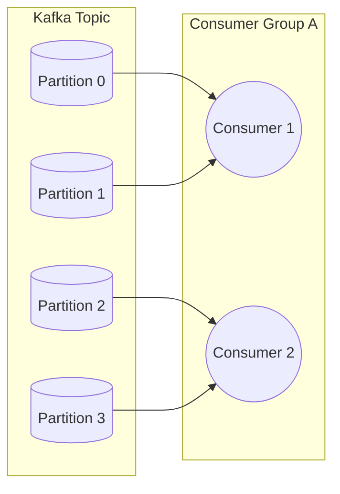

# Expected Answer

Kafka stores records in append-only topic partitions. 



Each partition has a total order, but there is no total order across a topic's partitions. A record key is typically hashed to select a partition, so use the aggregate key—such as `orderId`—when events for that aggregate must remain ordered. Partitions also set the maximum useful consumer parallelism for one consumer group: only one member owns a given partition at a time. Extra consumers beyond the partition count are idle.

Consumer groups allow independent applications to read the same topic while sharing work within each application. A group commits offsets to record its progress. Commit only after the business effect is durable; otherwise a crash can skip work. Committing after work gives at-least-once processing because a crash before commit repeats the record, so handlers need idempotency. Rebalances move partition ownership when members join, leave, or fail. A consumer must stop processing revoked partitions promptly and tolerate repeated records after its successor resumes.

# Why It Matters

Partition and offset choices determine ordering, throughput, and recovery correctness. Misunderstanding them leads to out-of-order state changes, duplicate effects, or consumers that appear healthy while falling behind.

# Example Code

```typescript
await consumer.run({
  eachMessage: async ({ topic, partition, message }) => {
    const event = JSON.parse(message.value!.toString());
    await applyIdempotently(event);
    // Auto-commit may now advance only after the durable effect above succeeds.
    console.log({ topic, partition, offset: message.offset });
  },
});
```

# Common Mistakes

- **Expecting ordering across partitions:** Records for different keys can be processed in any relative order.
- **Using random keys for per-order workflows:** Related records land in different partitions and lose their required sequencing.

# Follow-up Questions

- **What happens with more consumers than partitions?** (Answer: Some group members are idle because a partition has at most one owner in a group.)
- **Why can committed offsets still produce duplicates?** (Answer: A crash after applying a side effect but before committing repeats the record.)

# Related Questions

- [Event Processing Guarantees](/questions/event-processing-guarantees)
- [CQRS Projection Consistency](/questions/cqrs-projection-consistency)

# References

- [Apache Kafka: Consumer Groups](https://kafka.apache.org/documentation/#consumerconfigs_group.id)
- [Apache Kafka: Design—Consumers and Consumer Groups](https://kafka.apache.org/documentation/#design_consumerconfigs)
