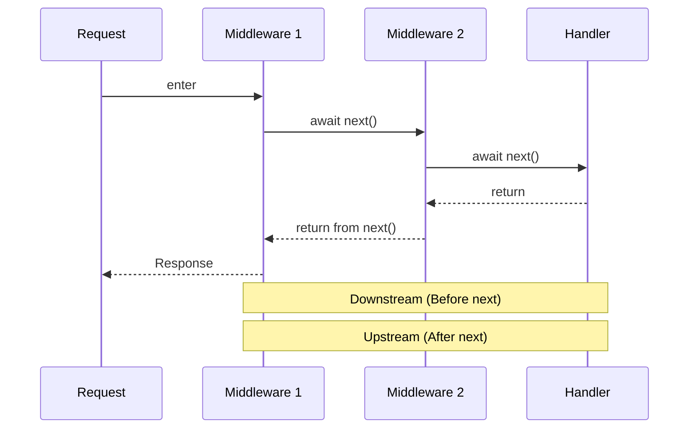

# Expected Answer (Koa 3.2.1 / Node.js 18+)

Koa composes async middleware in a cascade. 



Code before `await next()` runs while the request moves downstream; code after it runs as the stack unwinds upstream. Middleware registered first is the outermost wrapper. This makes timing, transaction cleanup, response transformation, and global errors natural: wrap `await next()` and act once downstream middleware has completed.

Calling no `next()` intentionally short-circuits the request, which is appropriate for authentication rejection or a cached response. Accidentally omitting it prevents later routes from running. Unlike a linear callback pipeline, Koa middleware can reliably perform work both before and after the handler through normal `async` control flow.

# Why It Matters

Understanding the cascade prevents incorrect logging, missing cleanup, and middleware order bugs.

# Code Example

```typescript
import Koa, { Context, Next } from 'koa';

const app = new Koa();
app.use(async (ctx: Context, next: Next) => {
  const start = Date.now();
  await next();
  ctx.set('X-Response-Time', `${Date.now() - start}ms`);
});
app.use((ctx: Context) => { ctx.body = { ok: true }; });
app.listen(3000);
```

# Common Mistakes

- **Forgetting `await next()`:** Later middleware and routes never execute.
- **Writing response logic before downstream work:** A later handler can overwrite the intended result.

# Follow-up Questions

- **Why register error middleware first?** (Answer: It must wrap every downstream middleware.)
- **Can middleware end a request early?** (Answer: Yes, by setting a response and not calling `next()`.)
