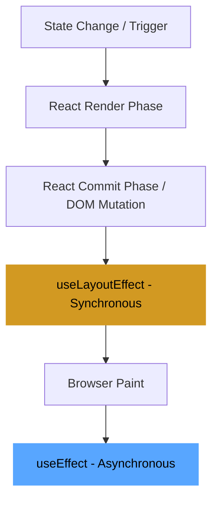

# Expected Answer

The difference lies in the **timing** of execution relative to the browser's paint cycle:



1.  **`useEffect` (Asynchronous)**: Runs **after** the browser has painted the screen. It is non-blocking and is the default choice for most side effects like data fetching, subscriptions, or logging.
2.  **`useLayoutEffect` (Synchronous)**: Runs **after** React has mutated the DOM but **before** the browser paints the changes. It blocks the paint, allowing you to measure layout and re-render synchronously to prevent visual flickering.

# Why It Matters

Using the wrong effect can cause a poor user experience. If you use `useEffect` to adjust the position of a tooltip based on an element's size, the user will see the tooltip appear in the wrong place for one frame, then jump to the right place (**flicker**). Using `useLayoutEffect` prevents this jump but can degrade performance if the effect logic takes too long, as the user will see a blank screen or a frozen UI.

# Example Code

```jsx
function Tooltip({ text }) {
  const [position, setPosition] = useState(0);
  const ref = useRef();

  useLayoutEffect(() => {
    // Measure DOM before the user sees the initial render
    const { width } = ref.current.getBoundingClientRect();
    setPosition(width / 2);
  }, []);

  return (
    <div ref={ref} style={{ left: position }}>
      {text}
    </div>
  );
}
```

# Common Mistakes

- **Defaulting to `useLayoutEffect`**: It should only be used for layout measurements. In 99% of cases, `useEffect` is the correct choice because it doesn't block the UI.
- **SSR Hydration Mismatch**: `useLayoutEffect` cannot run on the server. If a component uses it, it will trigger a warning during hydration because the server-rendered HTML won't match the client's first layout-adjusted render.

# Follow-up Questions

- **What happens if you update state inside `useLayoutEffect`?** (Answer: React will immediately perform a second render and diff, and only the final result will be painted to the screen).
- **Why does `useEffect` not cause a flicker for data fetching?** (Answer: Because data fetching is already an asynchronous operation; the initial "Loading" state is painted, and the subsequent "Data" state is painted whenever the promise resolves).

# References

- [React Docs: useLayoutEffect](https://react.dev/reference/react/useLayoutEffect)
- [React Docs: useEffect](https://react.dev/reference/react/useEffect)
